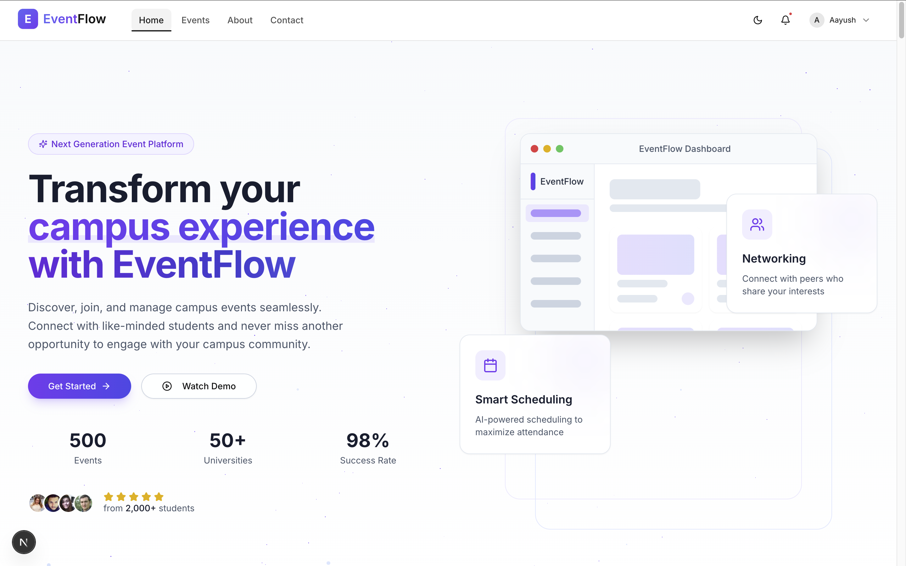

<div align="center">
    
  <h1>
    <span style="background: linear-gradient(90deg, #6366F1 0%, #8B5CF6 100%); -webkit-background-clip: text; -webkit-text-fill-color: transparent;">✨ EventFlow ✨</span>
  </h1>

  <p>
    <b>🚀 A modern, animated event management platform for seamless organization, registration, and certification 🎓</b>
  </p>

  <p>
    
    
    
    
    
    <!-- Add your live demo URL below if available -->
    <a href="https://eventflow.app" target="_blank"></a>
  </p>

  <br>
  
  <p>
    
  </p>
  
  <h3>❤️ Made with passion for seamless event experiences ❤️</h3>
</div>

<hr style="height: 3px; background: linear-gradient(90deg, #6366F1, #8B5CF6, #6366F1); border: none;">

## ✨ Features

<div style="display: grid; grid-template-columns: repeat(auto-fit, minmax(300px, 1fr)); gap: 16px;">

<div style="padding: 16px; border-radius: 8px; border-left: 4px solid #6366F1; background-color: rgba(99, 102, 241, 0.05);">

### 🎨 **Beautiful Event Creation**
Create and customize events with an intuitive, drag-and-drop interface that makes design simple and enjoyable.
</div>

<div style="padding: 16px; border-radius: 8px; border-left: 4px solid #EC4899; background-color: rgba(236, 72, 153, 0.05);">

### 📝 **Smart Registration**  
Build custom registration forms, send automated confirmation emails, and manage waitlists effortlessly.
</div>

<div style="padding: 16px; border-radius: 8px; border-left: 4px solid #8B5CF6; background-color: rgba(139, 92, 246, 0.05);">

### 🏅 **Automated Certificates**
Generate beautiful, verified digital certificates for attendees with just one click.
</div>

<div style="padding: 16px; border-radius: 8px; border-left: 4px solid #10B981; background-color: rgba(16, 185, 129, 0.05);">

### 📊 **Analytics Dashboard**
Track registrations, attendance, engagement metrics, and get actionable insights.
</div>

<div style="padding: 16px; border-radius: 8px; border-left: 4px solid #F59E0B; background-color: rgba(245, 158, 11, 0.05);">

### 🔒 **Enterprise-Grade Security**
JWT authentication, role-based access control, GDPR compliance, and more.
</div>

<div style="padding: 16px; border-radius: 8px; border-left: 4px solid #EF4444; background-color: rgba(239, 68, 68, 0.05);">

### 🌐 **Modern Tech Stack**
Built on Next.js, React, Node.js with cutting-edge animations and design patterns.
</div>

</div>

<hr style="height: 3px; background: linear-gradient(90deg, #6366F1, #8B5CF6, #6366F1); border: none;">

## 🌟 Live Demo

<div align="center">
  <a href="https://eventflow.app" target="_blank">
    
  </a>
  
  > 🔥 **[eventflow.app](https://eventflow.app)** - Experience the future of event management
</div>

## 📸 Interactive Experience

<div align="center">
  <div style="display: flex; flex-direction: column; gap: 20px; align-items: center;">
    <div style="position: relative; overflow: hidden; border-radius: 12px; box-shadow: 0 10px 30px -5px rgba(0, 0, 0, 0.3); transition: transform 0.3s ease;">
      
      <div style="position: absolute; bottom: 0; left: 0; right: 0; padding: 20px; background: linear-gradient(0deg, rgba(0,0,0,0.7) 0%, rgba(0,0,0,0) 100%); color: white; font-weight: bold;">
        🎮 Powerful Organizer Dashboard
      </div>
    </div>
    <div style="position: relative; overflow: hidden; border-radius: 12px; box-shadow: 0 10px 30px -5px rgba(0, 0, 0, 0.3); transition: transform 0.3s ease;">
      
      <div style="position: absolute; bottom: 0; left: 0; right: 0; padding: 20px; background: linear-gradient(0deg, rgba(0,0,0,0.7) 0%, rgba(0,0,0,0) 100%); color: white; font-weight: bold;">
        👑 Comprehensive Admin Controls
      </div>
    </div>
    <div style="position: relative; overflow: hidden; border-radius: 12px; box-shadow: 0 10px 30px -5px rgba(0, 0, 0, 0.3); transition: transform 0.3s ease;">
      
      <div style="position: absolute; bottom: 0; left: 0; right: 0; padding: 20px; background: linear-gradient(0deg, rgba(0,0,0,0.7) 0%, rgba(0,0,0,0) 100%); color: white; font-weight: bold;">
        🎓 Intuitive Student Experience
      </div>
    </div>
  </div>
</div>

## 🛠️ Cutting-Edge Tech Stack

<div align="center">
  <table>
    <tr>
      <th>🎨 Frontend</th>
      <th>⚙️ Backend</th>
      <th>💾 Database</th>
      <th>🚢 DevOps</th>
    </tr>
    <tr>
      <td>
        <br/>
        <br/>
        <br/>
        
      </td>
      <td>
        <br/>
        <br/>
        <br/>
        
      </td>
      <td>
        <br/>
        
      </td>
      <td>
        <br/>
        <br/>
        
      </td>
    </tr>
  </table>
</div>

## ⚡ Quick Start

<div style="background-color: rgba(99, 102, 241, 0.05); padding: 16px; border-radius: 8px; border-left: 4px solid #6366F1;">

```bash
git clone https://github.com/AAYUSH412/eventflow.git
cd eventflow
bash ./scripts/setup.sh
```
</div>

<details>
<summary><b>📋 Manual Setup Guide</b></summary>

<div style="padding: 20px; background-color: rgba(139, 92, 246, 0.05); border-radius: 8px; margin-top: 10px;">

### 🖥️ Backend Setup

```bash
cd backend
npm install
cp .env.example .env.local
# Edit .env.local as needed
npm run dev
```

### 🎨 Frontend Setup

```bash
cd ../frontend
npm install
npm run dev
```
</div>
</details>

## 🔌 API Overview

<div style="display: grid; grid-template-columns: repeat(auto-fit, minmax(250px, 1fr)); gap: 16px;">

<details>
<summary><b>🔑 Authentication</b></summary>

<div style="background-color: rgba(139, 92, 246, 0.05); padding: 16px; border-radius: 8px; margin-top: 10px;">

```http
POST /api/auth/register    # Create new account
POST /api/auth/login       # Get access token
GET  /api/auth/me          # Get current user
```
</div>
</details>

<details>
<summary><b>📅 Events</b></summary>

<div style="background-color: rgba(236, 72, 153, 0.05); padding: 16px; border-radius: 8px; margin-top: 10px;">

```http
GET    /api/events         # List all events
POST   /api/events         # Create new event
PUT    /api/events/:id     # Update event
DELETE /api/events/:id     # Delete event
```
</div>
</details>

<details>
<summary><b>📝 Registrations</b></summary>

<div style="background-color: rgba(16, 185, 129, 0.05); padding: 16px; border-radius: 8px; margin-top: 10px;">

```http
POST   /api/registrations         # Register for event
GET    /api/registrations/:id     # Get registration
PUT    /api/registrations/:id/checkin # Check-in
```
</div>
</details>

<details>
<summary><b>🏅 Certificates</b></summary>

<div style="background-color: rgba(245, 158, 11, 0.05); padding: 16px; border-radius: 8px; margin-top: 10px;">

```http
POST   /api/certificates/generate # Generate certificate
GET    /api/certificates/:id      # Verify certificate
```
</div>
</details>
</div>

## 🗺️ Future Roadmap

<div style="display: grid; grid-template-columns: repeat(auto-fit, minmax(300px, 1fr)); gap: 16px;">

<div style="background-color: rgba(99, 102, 241, 0.05); padding: 16px; border-radius: 8px; border-left: 4px solid #6366F1;">

### 📱 Mobile Application
<p>React Native mobile app with push notifications, offline mode, and QR code scanning</p>
</div>

<div style="background-color: rgba(236, 72, 153, 0.05); padding: 16px; border-radius: 8px; border-left: 4px solid #EC4899;">

### 📊 Advanced Analytics
<p>Interactive dashboards, predictive analytics, and custom reporting tools</p>
</div>

<div style="background-color: rgba(16, 185, 129, 0.05); padding: 16px; border-radius: 8px; border-left: 4px solid #10B981;">

### 💰 Payment Integration
<p>Multiple payment gateways, subscription models, and flexible pricing options</p>
</div>

<div style="background-color: rgba(245, 158, 11, 0.05); padding: 16px; border-radius: 8px; border-left: 4px solid #F59E0B;">

### 👥 Team Collaboration
<p>Role-based access control, communication tools, and team management</p>
</div>

<div style="background-color: rgba(239, 68, 68, 0.05); padding: 16px; border-radius: 8px; border-left: 4px solid #EF4444;">

### 🤖 AI Features
<p>Smart recommendations, automated scheduling, and personalized experiences</p>
</div>
</div>

## 🤝 Contributing

<div style="background-color: rgba(99, 102, 241, 0.05); padding: 16px; border-radius: 8px; border-left: 4px solid #6366F1;">

We welcome contributions from developers of all skill levels! To get started:

1. 🍴 Fork the repository
2. 🌱 Create your feature branch (`git checkout -b feature/amazing-feature`)
3. 💻 Commit your changes (`git commit -m 'Add some amazing feature'`)
4. 🚀 Push to the branch (`git push origin feature/amazing-feature`)
5. 🔍 Open a Pull Request

Please read our [CONTRIBUTING.md](CONTRIBUTING.md) for detailed guidelines.
</div>

## 👥 Contributors

<div align="center">
  <a href="https://github.com/AAYUSH412">
    
  </a>
  <!-- Add more contributors here -->
  <p>Want to see your face here? Contribute to EventFlow! 💪</p>
</div>

## 📄 License

<div style="background-color: rgba(99, 102, 241, 0.05); padding: 16px; border-radius: 8px; border-left: 4px solid #6366F1;">

This project is licensed under the [MIT License](LICENSE) - see the LICENSE file for details.
</div>

<div align="center">
  
  
  <br/>
  <p style="font-size: 12px; color: #6366F1;">© 2025 EventFlow. All Rights Reserved.</p>
  <p>
    <a href="https://github.com/AAYUSH412/eventflow" target="_blank">
      
    </a>
    <a href="https://twitter.com/eventflow" target="_blank">
      
    </a>
    <a href="https://linkedin.com/company/eventflow" target="_blank">
      
    </a>
  </p>
</div>